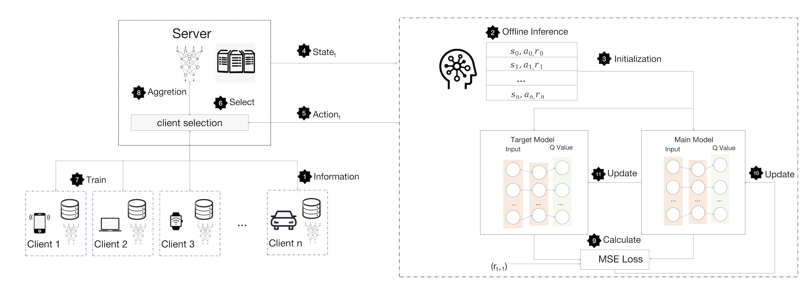

# BEFL
## Description
<strong>BEFL</strong>, a joint optimization framework aimed at balancing three objectives: enhancing global model accuracy, minimizing total energy consumption, and reducing energy usage disparities among devices. First, taking into account the communication constraints of MEIoT and the heterogeneity of devices, we employed the Sequential Least Squares Programming (SLSQP) algorithm for the rational allocation of communication resources. Based on this, we introduce a heuristic client selection algorithm that combines cluster partitioning with utility-driven approaches to alleviate both the total energy consumption of all devices and the discrepancies in energy usage.Furthermore, we utilize the proposed heuristic client selection algorithm as a template for offline imitation learning during pre-training, while adopting a ranking-based reinforcement learning approach online to further boost training efficiency. 

    

## How to run the Code
run <strong>main.ipynb</strong>